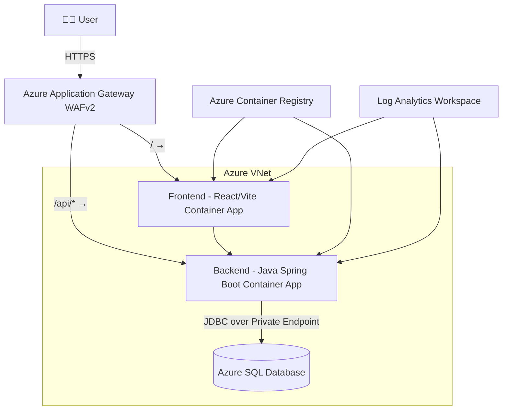

# 🚀 DevOps Project 2 — Secure 3-Tier Web App on Azure (Container Apps)

## 🧠 Overview  
This project demonstrates a **production-style 3-tier web application** deployed fully on **Microsoft Azure**, following DevOps best practices — including IaC with Terraform, containerization with Docker, and automation pipelines via GitHub Actions.  

The application is a **Burger Builder** web app built with:
- 🖥️ **Frontend:** React + Vite + TypeScript + Nginx  
- ⚙️ **Backend:** Java + Spring Boot + Maven  
- 💾 **Database:** Azure SQL Database (private endpoint only)  
- ☁️ **Hosting:** Azure Container Apps (private environment, internal load balancer)  
- 🌐 **Ingress:** Application Gateway WAF v2 (HTTPS only)  

---

## 🏗️ Architecture

### 🔹 Components
| Tier | Service | Description |
|------|----------|-------------|
| **Frontend** | Azure Container App (React + Vite + Nginx) | Serves the UI and communicates with backend through `/api` |
| **Backend** | Azure Container App (Spring Boot) | REST API for burger ingredients & orders |
| **Database** | Azure SQL Database | Stores app data; access restricted to VNet only |
| **Networking** | VNet + Subnets + NSGs | Frontend, backend, SQL each in its own subnet |
| **Ingress** | Application Gateway (WAF v2) | Only public entry point; routes `/` → frontend, `/api/*` → backend |
| **Monitoring** | Log Analytics + Application Insights | Centralized logging and metrics |
| **Registry** | Azure Container Registry (ACR) | Stores built Docker images |

---

## 🧩 Architecture Diagram

---

### ✅ Main Terraform Tasks
- Create Resource Group, VNet, and Subnets (frontend, backend, appgw, sql)
- Deploy Application Gateway (WAF v2)
- Deploy Azure SQL Database (Private Endpoint)
- Deploy Azure Container Apps Environment (internal load balancer)
- Deploy Frontend & Backend Container Apps
- Configure Private DNS zones for ACA and SQL
- Integrate Log Analytics Workspace
- Output FQDNs and AppGW Public IP

---

> ✅ The Application Gateway automatically routes `/api` traffic to the backend Container App.

---

## 🧭 Application Gateway Routing
| Path | Target | Description |
|------|---------|-------------|
| `/` | Frontend Container App | Main Burger Builder UI |
| `/api/*` | Backend Container App | REST API endpoints |

---

## 📊 Monitoring & Alerts
- Log Analytics Workspace + Application Insights
- Alerts configured for:
  - App Gateway backend health
  - CPU usage > 70%
  - SQL DTU > 80%

---

## ✅ Validation Checklist
- [x] SQL Private Endpoint (Public access disabled)
- [x] Container Apps in private subnet
- [x] Application Gateway WAFv2 routing correct
- [x] Terraform automated full deployment
- [x] App Insights integrated with Container Apps

---

## 🌟 Result
Application is fully functional at:

**Frontend:**  
👉 `http://48.210.248.193` (via App Gateway)

**Backend:**  
👉 `https://devopsproj2najla-backend.wonderfulpebble-d34e3f53.japaneast.azurecontainerapps.io/api/health`

**Database:**  
Private SQL Endpoint — accessible only from inside VNet.

---

## 👩‍💻 Author
**Najlaa Alahmari**  
DevOps Engineer | Ironhack Azure Bootcamp Graduate  
🔗 [GitHub: n2jlaa](https://github.com/n2jlaa)
